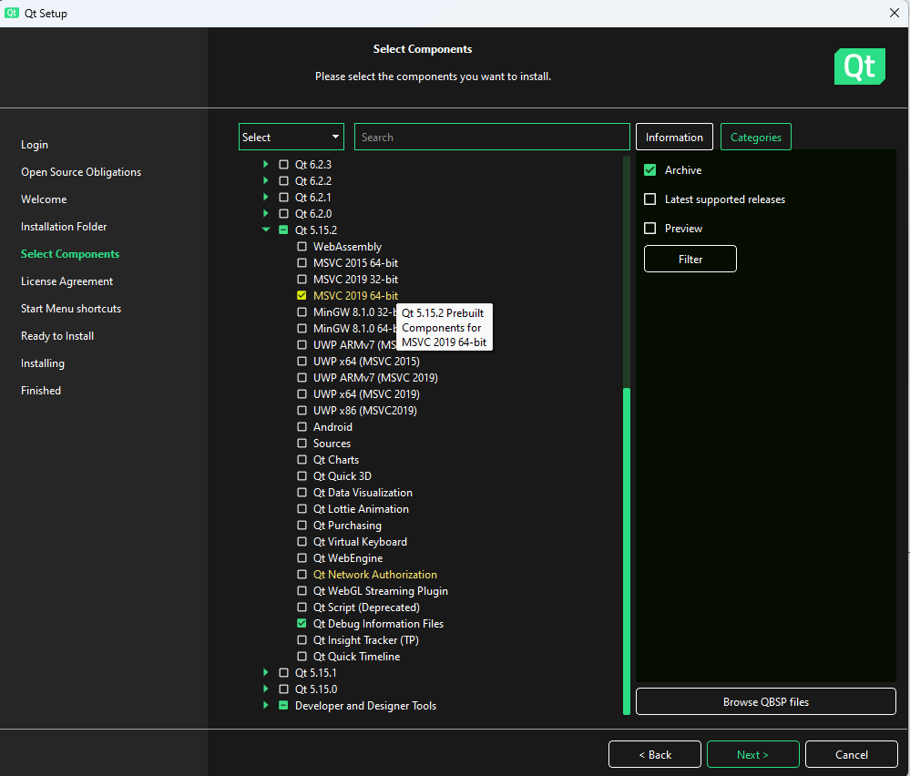

# BIAS

BIAS is a software application for recording video from IEEE 1394 and USB3
Cameras.  BIAS was intially designed as image acquisition software for
experiments in animial behavior. For example, recording the behavior of fruit
flies in a walking arena. 

## Features

BIAS provides the following features: 

* Control of camera properties (brightness, shutter, gain, etc.)
* Timed video recordings
* Support for a variety of video file formats (avi,fmf, ufmf, mjpg, raw image
* files) etc. 
* JSON based configuration files 
* External control via http commands - start/stop recording, set camera
* configuration etc.
* A plugin system for machine vision applications and for controlling external
* instrumentation
* Multiple cameras
* Image alignment tools
* Cross platform - windows, linux

## Documentation

http://public.iorodeo.com/notes/bias/

## Installation

### Windows 

- Download the release zip file `BIAS_exe_<version>.zip` from the "Releases" github page.
- Unzip this somewhere
- Run `test_gui.exe` (someday this will get a better name...)

## FlyTrack plugin

Step-by-step instructions for doing real-time tracking of a single fly:

- Start BIAS
- Connect the camera
- (Camera should be stopped for the following.)
- Under the **Plugins** menu, select **FlyTrack**.
- Under the **Plugins** menu, select **Enabled** and make sure that there is a check mark next to it.
- *Compute the background model image*. This step can be skipped if you have a pre-computed background image from a previous run. 
    - Access the plugin settings from the menu **Plugins->Settings**.
    - Choose **Mode: Compute Background Image**
    - Choose a location to save the background image to at the field **Bkgd Image Path**. There is currently limited error checking. Make sure that this is a reasonable path (file does not have to exist, but the parent directory does). Example: `C:/Code/BIAS/testdata/20240409T155835_P1_movie1_bg_v0.png`.
    - Click "Done"
    - Click **Start** to start the camera running. Switch to the **Plugin Preview** tab to see the current estimate of the background image. You can **Stop** the camera when the background image looks correct -- like what the video would look like without any flies in it. 
- Set up tracking mode:
    - Go back to **Plugins->Settings**.
    - Switch to **Mode: Track Fly**
    - If you skipped the "Compute the background model image" step above, select an existing **Bkgd Image Path** and click **Load**. This will be pre-loaded if you followed the "Compute the background model image" step above. The background image should be visible on the right side of the Settings dialog.
    - Modify the following parameters as needed:
        - Background subtraction parameters:
            - **Comparison Mode**: Whether flies are darker than the background, lighter than the background, or either. 
            - **Background Threshold**: Minimum difference from background to be considered foreground. 
        - Region of Interest (ROI) parameters: Set the Region of Interest (ROI) where the fly can be. This will be shown in the preview window with a red outline. 
        - The **History Buffer Length**, **Min Speed**, and **Speed Weight** parameters are used for telling which side of the fly is the head vs the tail. 
        - Output file parameters:
            - **Output Trajectory File Name**: Base name of the output trajectory. By default, this will go in the same directory as the video being logged. Example value: `track`. 
            - **Absolute Path**: If you prefer to specify the absolute path to the output file, specify it here. 
            - **Debug Output Folder**: Where to output debug information. Only needs to be set if the **Debug** flag is true. 
    - Click **Done**
- If you want to reuse this configuration later, select **File->Save Configuration**. The FlyTrack plugin configuration will be part of the general BIAS configuration file. You can load this configuration later by choosing **File->Load Configuration**. 
- If you want to record video as well, enable logging under the **Logging** menu. 
- **Start** the camera running. If you switch again to the **Plugin Preview** tab, you should see the foreground/background classification, the ellipse fit to this, and an asterisk plotted at the side of the fly assigned to tbe the head. 

## Developer Build Instructions

### Requirements
- Visual Studio 2022 Community Edition
- CMake 3.29.2
- Qt 5
- OpenCV 4
- Spinnaker 2.6.0 

### Notes
  
Here is how I built BIAS on Windows, May 2024. 

- Installed Visual Studio 2022 Community Edition.
- Selected the following workloads during install
    - Desktop development with C++
    - Universal Windows Platform development (not sure if this is necessary)
    - Python development (probably not necessary)
    - Github copilot workloads (definitely not necessary)
- Installed CMake 3.29.2 https://cmake.org/download/
- Install Qt5
    - if Anaconda is installed this comes with Qt:
        - Anaconda version 2023.07.1 was installed on my machine already, used its build of Qt
        - Added Qt to my PATH environment variable:
        - \<anaconda3>\Library\Lib\cmake\Qt5
        - \<anaconda3>\Library\plugins\platforms
        - \<anaconda3>\Library\bin
    - otherwise get the online installer from https://www.qt.io/download-open-source
        - activate the installation from "Archive"
        - choose the latest Qt5 version (e.g. 5.15.2)
        - select the build environment you want to use (e.g. MSVC 2019 64-bit)
        - deselect all other environments to save time and space
        - add to PATH: <qt5>\msvc2019_64\lib\cmake, <qt5>\msvc2019_64\bin, <qt5>\msvc2019_64\plugins\platform
- Cloned OpenCV 4 from https://github.com/opencv/opencv
- Built OpenCV:
  - In CMake, set <opencv> as source directory and <opencv>/build as build directory
  - Clicked Configure
  - Made sure WITH_FFMPEG was checked (default)
  - Made sure CMAKE_INSTALL_PREFIX was \<opencv>/build/install (default)
  - Clicked Configure
  - Clicked Generate
  - Opened the project in VisualStudio
  - Chose Release x64 and Build
- Added \<opencv>\build\bin\Release to PATH environment variable
- Downloaded and installed Spinnaker 2.6.0. There are newer versions, code might not be compatible.
- Opened BIAS in CMake, configured, made sure Spinnaker and Video backends were selected, generated, opened in VisualStudio, and built. 
- This builds test_gui.exe, which can be run by double-clicking or from the command line.
    - With the vanilla Qt5 installation, I also had to follow the [Qt Windows Deployment step](https://wiki.qt.io/Deploy_an_Application_on_Windows) and run: `<qt5>\msvc2019_64\bin\windeployqt.exe test_gui.exe`

