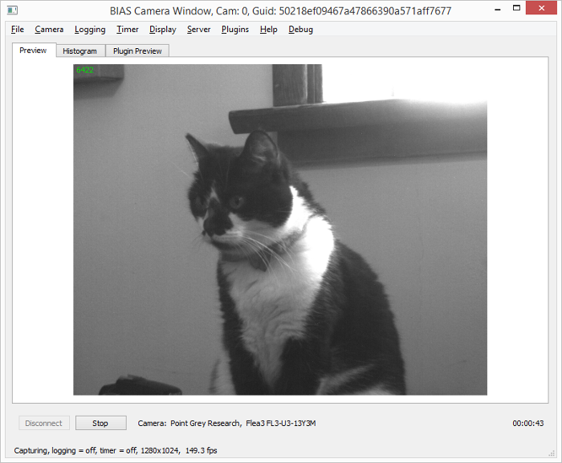
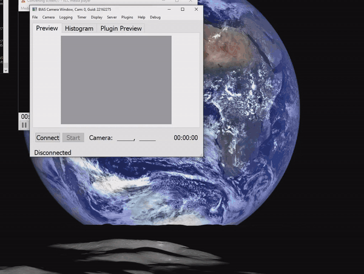

# BIAS

BIAS is a software application for recording video from IEEE 1394 and USB3
Cameras.  BIAS was intially designed as image acquisition software for
experiments in animial behavior. For example, recording the behavior of fruit
flies in a walking arena. 




## Features

BIAS provides the following features: 

* Control of camera properties (brightness, shutter, gain, etc.)
* Timed video recordings
* Support for a variety of video file formats (avi,fmf, ufmf, mjpg, raw image
* files) etc. 
* JSON based configuration files 
* External control via http commands - start/stop recording, set camera
* configuration etc.
* A plugin system for machine vision applications and for controlling external
* instrumentation
* Multiple cameras
* Image alignment tools
* Cross platform - windows, linux


## Documentation

http://public.iorodeo.com/notes/bias/

## Installation

### Windows 

- Download the release zip file `BIAS_exe_<version>.zip` from the "Releases" github page.
- Unzip this somewhere
- Run `test_gui.exe` (someday this will get a better name...)

## FlyTrack plugin



Step-by-step instructions for doing real-time tracking of a single fly:

- Start BIAS
- Connect the camera
- (Camera should be stopped for the following.)
- Under the **Plugins** menu, select **FlyTrack**.
- Under the **Plugins** menu, select **Enabled** and make sure that there is a check mark next to it.
- *Compute the background model image*. This step can be skipped if you have a pre-computed background image from a previous run. 
    - Access the plugin settings from the menu **Plugins->Settings**.
    - Choose **Mode: Compute Background Image**
    - Choose a location to save the background image to at the field **Bkgd Image Path**. There is currently limited error checking. Make sure that this is a reasonable path (file does not have to exist, but the parent directory does). Example: `C:/Code/BIAS/testdata/20240409T155835_P1_movie1_bg_v0.png`.
    - Click "Done"
    - Click **Start** to start the camera running. Switch to the **Plugin Preview** tab to see the current estimate of the background image. You can **Stop** the camera when the background image looks correct -- like what the video would look like without any flies in it. 
- Set up tracking mode:
    - Go back to **Plugins->Settings**.
    - Switch to **Mode: Track Fly**
    - If you skipped the "Compute the background model image" step above, select an existing **Bkgd Image Path** and click **Load**. This will be pre-loaded if you followed the "Compute the background model image" step above. The background image should be visible on the right side of the Settings dialog.
    - Modify the following parameters as needed:
        - **Background subtraction** (used to find the fly body):
            - **Comparison Mode**: Whether flies are darker than the background (`FLY_DARKER_THAN_BG`), lighter (`FLY_BRIGHTER_THAN_BG`), or either (`FLY_ANY_DIFFERENCE_BG`).
            - **Background Threshold**: Minimum difference from the background for a pixel to count as foreground (the body). Higher = stricter.
        - **Region of Interest (ROI)**: where the fly can be; drawn in the preview with a red outline. Pixels outside are ignored.
            - **ROI Type**: `CIRCLE` (a circular arena) or `NONE` (whole frame).
            - **ROI Center X**, **ROI Center Y**, **ROI Radius**: center and radius (pixels) of the circular ROI.
        - **Head/tail resolution** (which end is the head): decided each frame from the fly's velocity, its recent orientation, and — if wing tracking is on — the wings (which trail behind the head).
            - **History Buffer Length**: number of past frames used to smooth velocity and orientation.
            - **Min. Speed**: minimum speed (pixels/frame) before the velocity cue is trusted (a slow/stationary fly gives no velocity cue).
            - **Speed Weight**: weight of the velocity cue in the head/tail decision.
            - **Wing Weight (head/tail)**: weight of the wing cue in the head/tail decision (only active when **Track Wings** is on).
        - **Wing tracking** (estimates the two wing angles; enable **Track Wings**):
            - **Track Wings**: turn wing-angle tracking (and the wing-aided head/tail) on/off.
            - **Normalize wing diff by background brightness**: divide the background difference by the local background brightness before thresholding, so the wing thresholds are invariant to the arena's illumination gradient (recommended for backlit arenas). When **on**, the wing thresholds below are on a 0–255 "fraction of light blocked × 255" scale; when **off**, they are raw intensity-difference counts. (The thresholds need different values in the two modes.)
            - **Wing High Thresh** / **Wing Low Thresh**: hysteresis thresholds for wing pixels — a wing region must contain at least one pixel above *High* and grows out through pixels above *Low*.
            - **Body Thresh**: pixels whose difference exceeds this are treated as body, not wing. Keep it above the wings' brightness so the abdomen isn't mis-counted as wing.
            - **Max Wing Px Angle (deg)**: only pixels within this angle of the rear axis are considered wing pixels (the window for the wing-angle histogram).
            - **Num Angle Bins**: number of bins in the wing-angle histogram.
            - **Min Wing Area**: minimum number of wing pixels needed to attempt a fit / to keep a detected wing.
            - **Min Peak Dist (bins)**: minimum separation (histogram bins) required between the two wing peaks.
            - **2nd Peak Frac Factor**: a second wing is accepted only if its peak holds at least `factor / Num Angle Bins` of the wing pixels.
            - **Min Nonzero Angle (deg)**: guards against detecting two wings on the same side of the body.
            - **Min Peak Frac**: minimum fraction of pixels in the primary peak bin (`0` = always pass).
            - **Body Dilate Radius**: radius (px) the body mask is grown by before excluding it from the wing search; larger removes more near-body penumbra (and legs) at the edge of the body.
            - **Wing Open Radius**: radius (px) of the morphological open/close on the wing mask; larger erodes thin structures such as legs and noise.
            - **Quadfit Radius (bins)**: ± bins used for the sub-bin quadratic refinement of each wing-angle peak.
            - **Smoothing Filter (comma-sep)**: smoothing kernel applied to the wing-angle histogram (e.g. `0.25,0.5,0.25`).
        - **Preview** (display only; do not affect tracking):
            - **Show wing segmentation**: in the Plugin Preview, draw the body/wing pixel classification (body blue, wings orange, translucent over the real image) plus the wing-fit lines, with no ellipse — useful for tuning the wing thresholds.
            - **Zoom in on the fly**: crop the Plugin Preview to a box around the fly and upscale it so the fly fills the view (works with either the segmentation or ellipse view).
        - **Output file**:
            - **Output Trajectory File Name**: Base name of the output trajectory. By default, this will go in the same directory as the video being logged. Example value: `track`.
            - **Absolute Path**: If you prefer to specify the absolute path to the output file, specify it here.
            - **Debug Output Folder**: Where to output debug information. Only needs to be set if the **Debug** flag is true.
            - **Debug**: when checked, write diagnostic images (background difference, foreground mask, and the wing/body segmentation under `wingseg/`) to the **Debug Output Folder**.
    - Click **Done**
- If you want to reuse this configuration later, select **File->Save Configuration**. The FlyTrack plugin configuration will be part of the general BIAS configuration file. You can load this configuration later by choosing **File->Load Configuration**. 
- If you want to record video as well, enable logging under the **Logging** menu. 
- **Start** the camera running. If you switch again to the **Plugin Preview** tab, you should see the foreground/background classification, the ellipse fit to this, and an asterisk plotted at the side of the fly assigned to tbe the head. 

## Command-line arguments

`test_gui.exe` accepts the following options. These are mainly for **offline tracking of recorded videos** (and for batch/headless runs); with no options BIAS starts normally and captures from an attached camera.

| Option | Argument | Description |
| --- | --- | --- |
| `-i`, `--in`, `--in-video` | `<in-video-file>` | Capture from a video file instead of a camera. |
| `-c`, `--config` | `<config-file>` | Load a BIAS configuration (camera + plugin settings, including FlyTrack) from a JSON file at startup. |
| `-s`, `--start-frame` | `<start-frame>` | When reading from a video (`-i`), seek to and begin tracking at this frame instead of the beginning (video input only). Useful for jumping to a segment of interest without tracking from frame 0. |
| `-o`, `--out-track` | `<out-track-file>` | Write the FlyTrack trajectory to this path, overriding the output path in the config. |
| `--debug-seg-all-frames` | _(flag)_ | Dump the wing-segmentation debug image for **every** frame (to `<Debug Output Folder>/wingseg/wingseg_<frame>.png`) instead of only the first tracked frame. Requires **Debug** enabled in the config. Writes one PNG per frame — run short segments. |
| `-h`, `--help` | _(flag)_ | Show the help message and exit. |

Example — track a recorded video with a saved configuration, starting at frame 15000 and writing the trajectory to a chosen file:

```powershell
C:\Code\BIAS\build-vs\Release\test_gui.exe `
    -i C:\path\to\video.avi `
    -c C:\path\to\bias_config.json `
    -s 15000 `
    -o C:\path\to\trx.json
```

The FlyTrack plugin must be enabled (in the loaded config, or via the **Plugins -> Enabled** menu) for tracking to run.

## Developer Build Instructions

### Requirements
- Visual Studio 2022 Community Edition
- CMake 3.29.2
- Qt 5
- OpenCV 4
- Spinnaker 2.6.0 

### Notes
  
Here is how I built BIAS on Windows, May 2024. 

- Installed Visual Studio 2022 Community Edition.
- Selected the following workloads during install
    - Desktop development with C++
    - Universal Windows Platform development (not sure if this is necessary)
    - Python development (probably not necessary)
    - Github copilot workloads (definitely not necessary)
- Installed CMake 3.29.2 https://cmake.org/download/
- Install Qt5
    - if Anaconda is installed this comes with Qt:
        - Anaconda version 2023.07.1 was installed on my machine already, used its build of Qt
        - Added Qt to my PATH environment variable:
        - \<anaconda3>\Library\Lib\cmake\Qt5
        - \<anaconda3>\Library\plugins\platforms
        - \<anaconda3>\Library\bin
    - otherwise get the online installer from https://www.qt.io/download-open-source
        - activate the installation from "Archive"
        - choose the latest Qt5 version (e.g. 5.15.2)
        - select the build environment you want to use (e.g. MSVC 2019 64-bit)
        - deselect all other environments to save time and space
        - add to PATH: <qt5>\msvc2019_64\lib\cmake, <qt5>\msvc2019_64\bin, <qt5>\msvc2019_64\plugins\platform
- Cloned OpenCV 4 from https://github.com/opencv/opencv
- Built OpenCV:
  - In CMake, set <opencv> as source directory and <opencv>/build as build directory
  - Clicked Configure
  - Made sure WITH_FFMPEG was checked (default)
  - Made sure CMAKE_INSTALL_PREFIX was \<opencv>/build/install (default)
  - Clicked Configure
  - Clicked Generate
  - Opened the project in VisualStudio
  - Chose Release x64 and Build
- Added \<opencv>\build\bin\Release to PATH environment variable
- Downloaded and installed Spinnaker 2.6.0. There are newer versions, code might not be compatible.
- Opened BIAS in CMake, configured, made sure Spinnaker and Video backends were selected, generated, opened in VisualStudio, and built. 
- This builds test_gui.exe, which can be run by double-clicking or from the command line.
    - With the vanilla Qt5 installation, I also had to follow the [Qt Windows Deployment step](https://wiki.qt.io/Deploy_an_Application_on_Windows) and run: `<qt5>\msvc2019_64\bin\windeployqt.exe test_gui.exe`


#### Notes KB 2026-06-22

Installing dependencies
- Already had Visual Studio 2022 Community Edition.
- Installed CMake 4.4.0-rc2
- Already had /c/Code/opencv4
- Added C:\Code\opencv4\build\bin\Release to PATH environment variable
- Installed Spinnaker 2.6.0, selected SDK, added third party and C source, added GigE interface (made a copyin BIAS/resources)
- Installing Qt 5:
  - Downloaded the Online installer
  - Selected Custom
  - Under Show, selected Archived
  - Selected Qt for Development -> Qt -> Qt 5.15.2 -> MSVC 2019 64-bit
- Added C:\Qt\5.15.2\msvc2019_64\bin to PATH environment variable

 CMake compatibility updates needed for CMake 4:
- Updated all `cmake_minimum_required(VERSION 2.8 FATAL_ERROR)` calls to `VERSION 3.10`.
- Removed `cmake_policy(SET CMP0046 OLD)`, because CMake 4 no longer supports OLD behavior for CMP0046.
- Removed invalid `add_dependencies(... ${*_FORMS})` calls where `.ui` files were being treated as CMake targets. The generated UI headers are already included in the target source lists via `qt5_wrap_ui`.

Configure from PowerShell:

```powershell
cd C:\Code\BIAS
cmake -S . -B build-vs `
    -G "Visual Studio 17 2022" `
    -A x64 `
    -DOpenCV_DIR=C:\Code\opencv4\build `
    -DQt5_DIR=C:\Qt\5.15.2\msvc2019_64\lib\cmake\Qt5 `
    -Dwith_spin=ON `
    -Dwith_fc2=OFF `
    -Dwith_dc1394=OFF `
    -Dwith_qt_gui=ON `
    -Dwith_video_backend=ON `
    -Dwith_demos=OFF `
    -Dwith_tests=OFF
```

Build:
`cmake --build build-vs --config Release`

Deploy Qt runtime files next to the executable:
`C:\Qt\5.15.2\msvc2019_64\bin\windeployqt.exe C:\Code\BIAS\build-vs\Release\test_gui.exe`

Open project in Visual Studio:
- Open project `BIAS\build-vs\bias.sln`
- Set configuration to Release | x64

Copy the following DLLs next to test_gui.exe
OpenCV — from opencv4\build\bin\Release:

opencv_core490.dll
opencv_imgproc490.dll
opencv_imgcodecs490.dll
opencv_videoio490.dll
opencv_videoio_ffmpeg490_64.dll
Spinnaker + GenICam — from C:\Program Files\FLIR Systems\Spinnaker\bin64\vs2015:

SpinnakerC_v140.dll
Spinnaker_v140.dll
libiomp5md.dll
GCBase_MD_VC140_v3_0.dll
GenApi_MD_VC140_v3_0.dll
Log_MD_VC140_v3_0.dll
log4cpp_MD_VC140_v3_0.dll
MathParser_MD_VC140_v3_0.dll
NodeMapData_MD_VC140_v3_0.dll
XMLParser_MD_VC140_v3_0.dll

Program was crashing in the StampedePlugin, commented out. 