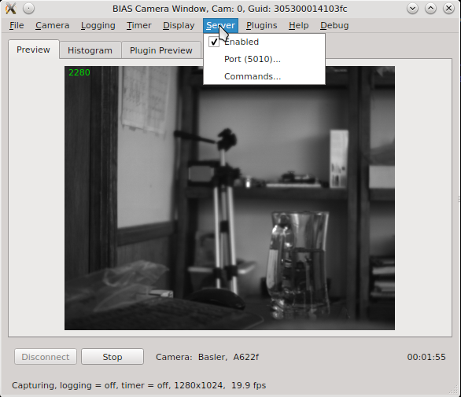

# External Control HTTP Commands

> [!WARNING]
> This current state of the documentation is rescued from an archive file, matched BIAS-v0.58 
> released on Jun 28, 2020 and was partially outdated at that time. 

BIAS can be controlled via external HTTP commands when the external control server is enabled. The can be done by checking the “Enabled” item under the “Server” menu as shown below.



The port number used by the external control server, when enabled, is shown in the second menu item - e.g. Port(5010).

## Basic Command Structure

Commands are sent using http GET request as follows:

```http
http://localhost:5010/?<commandName>=<commandArgs>
```

where “commandName” is the name of the and “commandArg” is the command argument (possibly empty). In this example the “localhost” is used for the devie address and the port is assumed to be 5010. The local computers IP address may used in place of “localhost”.

As an example consider the “stop-capture” command which instructs BIAS to stop capturing images from the camera. This command can be issued as follows:

http://localhost:5010/?connect

In response to each command BIAS will return a JSON object containing the name of the command, a flag indicating the success or failure of the command, a message indicating the reason for failure (if failure occurred), and the desired response value (if successful). For example, the response to a successful “set-video-file” command would be as follows:

```json
{
    "command" : "set-video-file",
    "message" : "",
    "success" : true,
    "value" : ""
}
```

## BIAS Commands

This list of commands accepted by BIAS is as follows: 


### connect

Connect to the camera which is associated with the given BIAS camera window (specified by port address).

```http
http://localhost:5010/?connect
```

### disconnect

Disconnect from the camera which is associated with the given BIAS camera (specified by port address).

```http
http://localhost:5010/?disconnect
```

### start-capture

Starts image capture on the associated camera. Note, the camera must be connected for the command to be successful.

```http
http://localhost:5010/?start-capture
```

Note, the current connection status of the camera can be queried using [get-status](#get-status) command.

### stop-capture

Stops image capture on the associated camera.

```
http://localhost:5010/?stop-capture
```

### get-configuration

Returns the current BIAS configuration in the json format (all GUI and camera settings).

```http
http://localhost:5010/?get-configuration
```

An example of the typical data returned by this command can be found here [BIAS JSON Configuration Example](bias_json_config.md). Note, the camera must be connected for this command to be successful.

### set-configuration

Sets the configuration of the associated GUI window and camera (specified by port address) to that given by the json configuration provided in the command argument.

```http
http://localhost:5010/?set-configuration=<json configuration object>
```

Note, the camera must be connected for this command to be successful. In addition the configuration data must be valid for the users camera make and model. An example of setting the configuration for a Point Grey Flea3 FL3-U3-13Y3M camera is shown below.

```http
http://localhost:5010/?set-configuration={ "camera" : { "format7Settings" : { "mode" : "0", "pixelFormat" : "RAW8", "roi" : { "height" : 1024, "offsetX" : 0, "offsetY" : 0, "width" : 1280 } }, "frameRate" : "Format7", "guid" : "50218ef09467a47866390a571aff7677", "model" : "Flea3 FL3-U3-13Y3M", "properties" : { "autoExposure" : { "absoluteControl" : false, "absoluteValue" : 1.32196044921875, "autoActive" : true, "on" : true, "onePush" : false, "present" : true, "value" : 480 }, "brightness" : { "absoluteControl" : false, "absoluteValue" : 0.0, "autoActive" : false, "on" : true, "onePush" : false, "present" : true, "value" : 16 }, "focus" : { "absoluteControl" : false, "absoluteValue" : 0.0, "autoActive" : false, "on" : false, "onePush" : false, "present" : false, "value" : 0 }, "frameRate" : { "absoluteControl" : false, "absoluteValue" : 150.0, "autoActive" : true, "on" : true, "onePush" : false, "present" : true, "value" : 480 }, "gain" : { "absoluteControl" : false, "absoluteValue" : 18.06179046630859375, "autoActive" : true, "on" : true, "onePush" : false, "present" : true, "value" : 275 }, "gamma" : { "absoluteControl" : false, "absoluteValue" : 1.0, "autoActive" : false, "on" : false, "onePush" : false, "present" : true, "value" : 1024 }, "hue" : { "absoluteControl" : false, "absoluteValue" : 0.0, "autoActive" : false, "on" : false, "onePush" : false, "present" : false, "value" : 0 }, "iris" : { "absoluteControl" : false, "absoluteValue" : 0.0, "autoActive" : false, "on" : false, "onePush" : false, "present" : false, "value" : 0 }, "pan" : { "absoluteControl" : false, "absoluteValue" : 0.0, "autoActive" : false, "on" : false, "onePush" : false, "present" : false, "value" : 0 }, "saturation" : { "absoluteControl" : false, "absoluteValue" : 0.0, "autoActive" : false, "on" : false, "onePush" : false, "present" : false, "value" : 0 }, "sharpness" : { "absoluteControl" : false, "absoluteValue" : 0.0, "autoActive" : false, "on" : false, "onePush" : false, "present" : true, "value" : 1024 }, "shutter" : { "absoluteControl" : false, "absoluteValue" : 3.3347010612487792969, "autoActive" : false, "on" : true, "onePush" : false, "present" : true, "value" : 522 }, "temperature" : { "absoluteControl" : false, "absoluteValue" : 3.2084748744964599609, "autoActive" : false, "on" : false, "onePush" : false, "present" : true, "value" : 3209 }, "tilt" : { "absoluteControl" : false, "absoluteValue" : 0.0, "autoActive" : false, "on" : false, "onePush" : false, "present" : false, "value" : 0 }, "triggerDelay" : { "absoluteControl" : false, "absoluteValue" : 0.0, "autoActive" : false, "on" : false, "onePush" : false, "present" : true, "value" : 0 }, "triggerMode" : { "absoluteControl" : false, "absoluteValue" : 0.0, "autoActive" : false, "on" : false, "onePush" : false, "present" : true, "value" : 0 }, "whiteBalance" : { "absoluteControl" : false, "absoluteValue" : 0.0, "autoActive" : false, "on" : false, "onePush" : false, "present" : false, "valueBlue" : 0, "valueRed" : 0 }, "zoom" : { "absoluteControl" : false, "absoluteValue" : 0.0, "autoActive" : false, "on" : false, "onePush" : false, "present" : false, "value" : 0 } }, "triggerType" : "Internal", "vendor" : "Point Grey Research", "videoMode" : "Format7" }, "configuration" : { "directory" : "C:/Users/Will/Documents", "fileName" : "bias_config" }, "display" : { "colorMap" : "None", "orientation" : { "flipHorizontal" : false, "flipVertical" : false }, "rotation" : 0, "updateFrequency" : 15.0 }, "logging" : { "autoNamingOptions" : { "cameraIdentifier" : "CameraNumber", "includeCameraIdentifier" : true, "includeTimeAndDate" : true, "includeVersionNumber" : true, "timeAndDateFormat" : "'date'_yyyy_MM_dd_'time'_hh_mm_ss" }, "directory" : "C:/Users/Will/Videos", "enabled" : false, "fileName" : "bias_video", "format" : "ufmf", "settings" : { "avi" : { "codec" : "XVID", "frameSkip" : 1 }, "bmp" : { "frameSkip" : 1 }, "fmf" : { "frameSkip" : 1 }, "ufmf" : { "backgroundThreshold" : 40, "boxLength" : 30, "compressionThreads" : 15, "dilate" : { "on" : false, "windowSize" : 2 }, "frameSkip" : 1, "medianUpdateCount" : 100, "medianUpdateInterval" : 50 } } }, "server" : { "enabled" : true, "port" : 5010 }, "timer" : { "enabled" : false, "settings" : { "duration" : 30 } } } 
```

### enable-logging

Enable logging of video data to data file. This command is equivalent to checking the “Logging -> enabled” checkbox.

```http
http://localhost:5010/?enable-logging
```

Note, logging cannot be enabled during image capture. In order to enable logging the current capture (if running) must be stopped - via the [stop-capture](#stop-capture) command or equivalent. Then logging may be enabled and capture resumed. Attempting to enable logging during capture will return an error as follows:

```json
{
    "command" : "enable-logging",
    "message" : "Unable to enable logging: capturing images",
    "success" : false,
    "value"   : ""
}
```

### disable-logging

Disable logging of video data. This command is equivalent to unchecking the “Logging -> enabled” checkbox.

```http
http://localhost:5010/?disable-logging
```

Note, logging cannot be disabled if image capture has been started. In order to disable logging it is necessary to first capturing images via the [stop-capture](#stop-capture) command or similar. Attempting to disable logging during capture will return an error as follows:

```json
{
    "command" : "disable-logging",
    "message" : "Unable to disable logging: capturing images",
    "success" : false,
    "value"   : ""
}
```

### load-configuration

Load and set the BIAS configuration from the file given as an argument.

```http
http://localhost:5010/?load-configuration=<json configuration file>
```

Note, the camera must be connected for the command to be successful. An example of the command for a configuration file name “bias_config.json” located in “C:\Users\Will\Documents” is given below.

http://localhost:5010/?load-configuration=C:\Users\Will\Documents\bias_config.json

### save-configuration

Save the current BIAS configuration to the specified file.

```http
http://localhost:5010/?save-configuration=<json configuration file>
```

Note, the camera must be connected for the command to be successful. An example of the command for creating a configuration file named “my_config.json” in the “C:\Users\Will\Documents” directory is a given below.

```http
http://localhost:5010/?save-configuration=C:\Users\Will\Documents\my_config.json
```

### close

Closes the BIAS camera window (specified via port address).

```http
http://localhost:5010/?close
```

Note, the BIAS camera window cannot be closed using this command if image capture has been started.

### get-frame-count

Returns the current frame count from the associate BIAS camera window.

```http
http://localhost:5010/?get_frame-count
```

The frame count is returned in the “value” field of the response. An example response is given below.

```json
{ "command": "get-frame-count", "message": "", "success": true, "value": 209 }
```

### get-camera-guid

Returns the camera’s GUID (Globally Unique Identifier).

```http
http://localhost:5010/?get-camera-guid
```

The GUID of the camera is returned in the “value” field of the response. An example response is given below.

```json
{ "command": "get-camera-guid", "message": "", "success": true, "value": "305300014103fc" }
```

### get-status

Returns status information for the BIAS application in JSON format.

```http
http://localhost:5010/?get-status
```

The status information is returned in the “value” field of the response. The information includes following fields:

- capturing - true/false indicating whether or not the camera is connected,
- connected - true/false indicating whether or not the camera is currently capturing images,
- frameCount - integer giving the current frame count,
- framePerSec - double specifing the current frame rate,
- logging - true/false indicating whether or not logging is enabled
- timeStamp - the current time stamp.

An example response is given below.

```json
{
    "command" : "get-status",
    "message" : "",
    "success" : true,
    "value"   : {
        "capturing"    : true,
        "connected"    : true,
        "frameCount"   : 91,
        "framesPerSec" : 149.0,
        "logging"      : false,
        "timeStamp"    : 4.58
    }
}
```

### set-video-file

Sets the current video file name for logging.

```http
http://localhost:5010/?set-video-file=<video file name>
```

Note, video file name must specify the full path to the desired video file. The target directory must exist. Any file extension is ignored - BIAS will set this based on the current video file format. For example, setting the video file to “my_video_file” located in “C:\Users\Will\Documents” can be accomplished as follows:

```http
http://localhost:5010/?set-video-file=C:\Users\Will\Documents\my_video_file
```

### get-video-file

Returns the full path to the currently specified video file.

```http
http://localhost:5010/?get-video-file
```

The video file name is returned in the value field of the response. An example response is given below:

```json
{
    "command" : "get-video-file",
    "message" : "",
    "success" : true,
    "value" : "C:/Users/Will/Documents/my_video_file.ufmf"
}
```

### get-time-stamp

Returns the current image capture time stamp.

```http
http://localhost:5010/?get-time-stamp
```

The time stamp is return in the value field of the response and in is units (sec). An example response is given below.

```json
{
    "command" : "get-time-stamp",
    "message" : "",
    "success" : true,
    "value"   : 8.3555820000000000647
}
```

### get-frames-per-sec

Returns the (measured) frame rate for the current capture (zero otherwise).

```http
http://localhost:5010/?get-frames-per-sec
```

The frame rate (in seconds) is returned in the “value” field of the response. An example response is given below.

``json
{
    "command" : "get-frames-per-sec",
    "message" : "",
    "success" : true,
    "value"   : 149.5
}
```

### get-window-geometry

Returns the current (GUI) camera window geometry - i.e. the x position, y position, width and height in pixels.

```http
http://localhost:5010/?get-window-geometry
```

The window geometry information is returned in the “value’ field of the response. An example response is given below.

```json
{
    "command" : "get-window-geometry",
    "message" : "",
    "success" : true,
    "value"   : {
        "height" : 479,
        "width"  : 581,
        "x"      : 1099,
        "y"      : 23
    }
}
```

### set-window-geometry

Sets the geometry for the current camera window GUI.

```http
http:://localhost:5010/?set-window-geometry=<window geometery json data>
```

The window geometry data is specified in the json format as shown below

```json
{
    "height" : 479,
    "width"  : 581,
    "x"      : 1099,
    "y"      : 23
}
```

An example demonstrating how to set the window geometry is as follows

```http
http://localhost:5010/?set-window-geometry={"height":600,"width":600,"x":1000,"y":100}
```

### plugin-cmd

Runs a command specific to a BIAS plugin. For example

```
http://localhost:5010/?plugin-cmd={"plugin":<plugin name>,"cmd": <command name>, <optional cmd args>}}
```

The `<plugin name>`, `<command name>` and `<optional arguments>` are specific to the given plugin. In general different plugins will different commands available.


## Grab Detector Plugin Commands

The list of available commands for the grab detector plugin are given below.

### connect

Connects the grab detector plugin to the trigger device hardware.

```http
http::/localhost:5010?/plugin-cmd={"plugin":"grabDetector","cmd": "connect"}
```

### disconnect

Disconnects the grab detector plugin from the trigger device hardware.

```http
http://localhost:5010?/plugin-cmd={"plugin":"grabDetector","cmd":"disconnect"}
```

### reset

Resets (re-enables) the grab detector hardware trigger

```http
http://localhost:5010?/plugin-cmd={"plugin":"grabDetector","cmd":"reset"}
```

### set-config

Set the grab detector plugin’s configuration

```http
http://localhost:5010/?plugin-cmd={"plugin":"grabDetector","cmd":"set-config","config":<config-json>}
```

where `<config-json>` is a JSON object containing the desired plugin configuration parameters. An example is given below:

```json
{
    "detectBox" : {
        "color" : "ff0000",
        "height" : 100,
        "width" : 100,
        "xPos" : 0,
        "yPos" : 0
    },
    "device" : {
        "autoConnect" : false,
        "outputPin" : 4,
        "portName" : "ttyUSB0",
        "pulseDuration" : 0.02
    },
    "trigger" : {
        "armedState" : true,
        "enabled" : true,
        "medianFilter" : 3,
        "threshold" : 100
    }
}
```